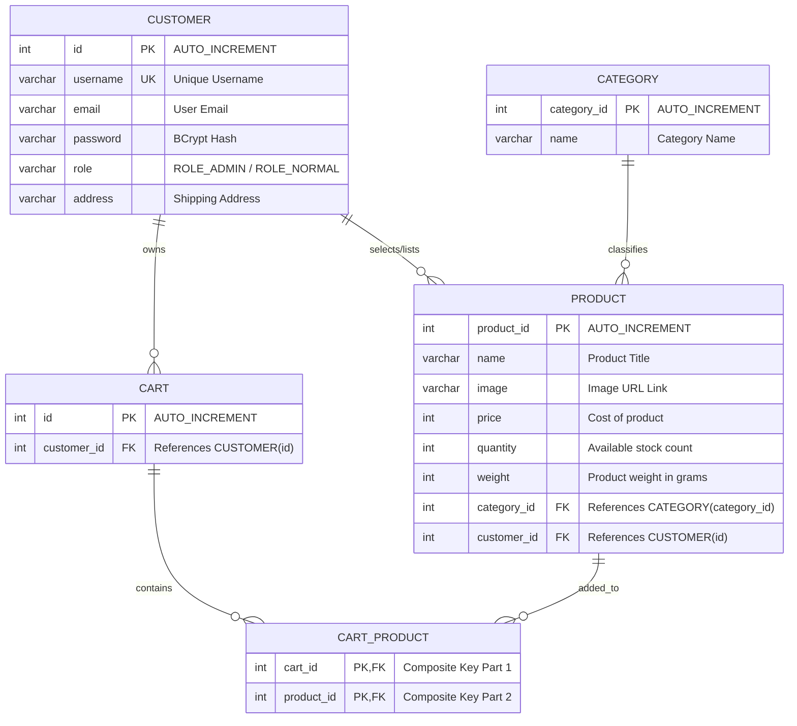

# 🛒 E-Commerce Spring Boot (JSP + Hibernate)

A production-ready, robust Java E-Commerce web application built on the **Spring Boot** framework, employing **Hibernate ORM (SessionFactory)** for data persistence, **Spring Security** for role-based access control, and **JSP (JavaServer Pages) + JSTL** for the dynamic web view layer.

---

## 📖 Table of Contents
1. [Key Features & Highlights](#-key-features--highlights)
2. [Detailed Tech Stack](#-detailed-tech-stack)
3. [System Architecture & Design Patterns](#-system-architecture--design-patterns)
4. [Database Schema & Entity Relationships](#-database-schema--entity-relationships)
5. [Security & Authentication Architecture](#-security--authentication-architecture)
6. [MVC Controller & Endpoint Mapping](#-mvc-controller--endpoint-mapping)
7. [Getting Started & Installation](#-getting-started--installation)
8. [CI/CD Pipeline Details](#-cicd-pipeline-details)
9. [Troubleshooting & Core Configurations](#-troubleshooting--core-configurations)

---

## 🌟 Key Features & Highlights

- **Multi-Role User Portals:** Separate, secure experiences for **Administrators** and **Customers**.
- **Admin Dashboard:** Control panels to manage the product inventory, categorize products, and audit registered customers.
- **Custom Hibernate Configuration:** Leverages a programmatically defined `LocalSessionFactoryBean` (Hibernate SessionFactory) instead of standard Spring Data JPA, ensuring fine-grained session control.
- **Dynamic Password Migration:** Legacy plain-text passwords seeded in the database are automatically upgraded to BCrypt hashed representations upon user login or lookup.
- **Spring Security Configuration:** Dual-security filter chains configured to separate user-facing routes from administrative portals.
- **Continuous Integration Ready:** Built-in Jenkins pipeline configuration to automate testing, compilation, and packaging.

---

## 🛠️ Detailed Tech Stack

| Technology | Version | Description |
|---|---|---|
| **Java Development Kit (JDK)** | `11` | Core runtime platform. |
| **Spring Boot** | `2.6.4` | Application core container and MVC framework. |
| **Spring Security** | `5.6.x` | Role-based authorization & authentication. |
| **Hibernate ORM** | `5.6.x` | Custom SessionFactory-based persistence provider. |
| **Database Engine** | **MySQL `8.x`** | Relational Database Management System. |
| **View Template Engine** | **JSP + JSTL** | Server-side template rendering engine. |
| **Servlet Container** | **Tomcat Jasper** | Embed engine to compile and render JSP files. |
| **Build Automation** | **Maven** | Dependency management and packaging build system. |

---

## 🏗️ System Architecture & Design Patterns

The project is structured around a classic **layered MVC (Model-View-Controller)** architecture to enforce clear separation of concerns (SoC):

```
src/main/java/com/jtspringproject/JtSpringProject/
├── configuration/              # Spring Security and Cryptographic Configurations
│   ├── PasswordEncoderConfig.java
│   └── SecurityConfiguration.java
├── controller/                 # MVC Controllers handling Request-Response mapping
│   ├── AdminController.java
│   ├── UserController.java
│   └── ErrorController.java
├── services/                   # Business Logic Layer exposing transactional operations
│   ├── userService.java
│   ├── productService.java
│   ├── categoryService.java
│   └── cartService.java
├── dao/                        # Data Access Object Layer executing Hibernate queries
│   ├── userDao.java
│   ├── productDao.java
│   ├── categoryDao.java
│   ├── cartDao.java
│   └── cartProductDao.java
├── models/                     # JPA/Hibernate Entities mapping MySQL tables
│   ├── User.java
│   ├── Category.java
│   ├── Product.java
│   ├── Cart.java
│   ├── CartProduct.java
│   └── CartProductId.java
└── HibernateConfiguration.java # Bootstrapping SessionFactory and Datasource Beans
```

### 🧩 Core Architectural Components

1. **Custom Hibernate Integration (`HibernateConfiguration.java`):**
   Exposes a programmatically configured `LocalSessionFactoryBean` using environment variables. Transaction management is handled by `HibernateTransactionManager` bound to the SessionFactory.
2. **DAO Layer:**
   Unlike standard JpaRepository interfaces, the DAOs inject the custom Hibernate `SessionFactory` and query the database using active sessions:
   ```java
   this.sessionFactory.getCurrentSession().createQuery("from CART", Cart.class).list();
   ```
3. **Service Layer:**
   Encapsulates transaction-aware business workflows (e.g., category operations, inventory updates, and cryptographic checks).
4. **View Layer (`/src/main/webapp/views/`):**
   Utilizes JavaServer Pages (JSP) and JSP Standard Tag Library (JSTL) to compile views dynamically.

---

## 🗄️ Database Schema & Entity Relationships

The relational model contains five tables mapping users, products, and shopping carts.



### 📝 Database Schema Seeding (`basedata.sql`)
The default schema initializes a database named `ecommjava` and seeds:
- **Default Category Set:** Fruits, Vegetables, Meat, Fish, Dairy, Bakery, Drinks, Sweets, and Other.
- **Administrative Account:** `admin` (Password: `123`, Role: `ROLE_ADMIN`)
- **Customer Account:** `lisa` (Password: `765`, Role: `ROLE_NORMAL`)

---

## 🔐 Security & Authentication Architecture

Authentication is powered by **Spring Security**, utilizing custom multi-layer filter chains.

### 🛡️ Dual Filter Chain Setup
1. **Admin Chain (`Order(1)`):**
   - Applies exclusively to `/admin/**` routes.
   - The login endpoint is `/admin/login` and processing URL is `/admin/loginvalidate`.
   - Restricts access strictly to accounts containing the `ADMIN` role.
2. **User Chain (`Order(2)`):**
   - Applies to the rest of the application (`/**`).
   - Public paths `/login`, `/register`, and `/newuserregister` are permitted.
   - All other routes require authentication under `ROLE_USER`.

### 🔄 Dynamic Password Migration (Legacy Integration)
To bridge the gap between seeded plain-text credentials and the modern standard `BCryptPasswordEncoder`, a dynamic migration process is implemented within `userService.java`:

```java
public User getUserByUsername(String username) {
    User user = userDao.getUserByUsername(username);
    if (user != null && user.getPassword() != null && !isPasswordEncoded(user.getPassword())) {
        // Dynamic legacy password migration to BCrypt on-load
        user.setPassword(passwordEncoder.encode(user.getPassword()));
        userDao.saveUser(user);
    }
    return user;
}
```
Whenever a legacy user logs in, their password prefix is inspected. If it lacks a valid BCrypt signature (`$2a$`, `$2b$`, `$2y$`), it is instantly encrypted and saved back to the database.

---

## 🛣️ MVC Controller & Endpoint Mapping

| Endpoint Pattern | HTTP Method | Authorized Role | View Resolved | Controller / Purpose |
|---|---|---|---|---|
| **Public / Auth Routes** | | | | |
| `/login` | `GET` | PermitAll | `userLogin.jsp` | Renders user login portal. |
| `/register` | `GET` | PermitAll | `register.jsp` | Renders user registration form. |
| `/newuserregister` | `POST` | PermitAll | `userLogin.jsp` / `register.jsp` | Creates user account with `ROLE_NORMAL`. |
| `/logout` | `GET` | User / Admin | Redirect to `/login` | Invalidates active user session. |
| **Customer Area** | | | | |
| `/` | `GET` | `USER` | `index.jsp` | Customer home page displaying products. |
| `/user/products` | `GET` | `USER` | `uproduct.jsp` | Product gallery available for purchase. |
| `/profileDisplay` | `GET` | `USER` | `updateProfile.jsp` | Display profile settings. |
| `/updateuser` | `POST` | `USER` | Redirect to `/` | Persists changes and updates active principal context. |
| `/buy` | `GET` | `USER` | `buy.jsp` | Mock checkout / billing layout. |
| **Admin Area** | | | | |
| `/admin/login` | `GET` | PermitAll | `adminlogin.jsp` | Admin login portal. |
| `/admin/` or `Dashboard`| `GET` | `ADMIN` | `adminHome.jsp` | Admin landing page. |
| `/admin/categories` | `GET` | `ADMIN` | `categories.jsp` | Displays available inventory categories. |
| `/admin/categories` | `POST` | `ADMIN` | Redirect to categories | Adds a new product category. |
| `/admin/categories/delete` | `POST` | `ADMIN` | Redirect to categories | Deletes category by ID. |
| `/admin/categories/update` | `POST` | `ADMIN` | Redirect to categories | Modifies category name. |
| `/admin/products` | `GET` | `ADMIN` | `products.jsp` | Lists all products in the catalog. |
| `/admin/products/add` | `GET` | `ADMIN` | `productsAdd.jsp` | Renders form to add a product. |
| `/admin/products/add` | `POST` | `ADMIN` | Redirect to products | Persists new product model. |
| `/admin/products/update/{id}` | `GET` | `ADMIN` | `productsUpdate.jsp` | Renders edit page for a specific product. |
| `/admin/products/update/{id}` | `POST` | `ADMIN` | Redirect to products | Updates product parameters. |
| `/admin/products/delete` | `POST` | `ADMIN` | Redirect to products | Removes product from DB. |
| `/admin/customers` | `GET` | `ADMIN` | `displayCustomers.jsp` | Audits all registered customers. |

> [!NOTE]
> **Cart Subsystem Status:** The `Cart`, `CartProduct`, and `CartProductId` entities along with their repository-level classes are fully implemented in Java. However, user-facing routes (such as adding items to cart and checking out) are currently decoupled from MVC mappings, representing a workspace candidate for future full frontend integrations. Legacy scriptlets containing raw JDBC connections reside inside `cartproduct.jsp`.

---

## 🚀 Getting Started & Installation

### 📋 Prerequisites
- **Java Development Kit (JDK) 11+** installed and set on environment path.
- **Apache Maven 3.8+** installed.
- **MySQL 8.x Server** instance running locally.

### 1) Initialize the Database
Log into your MySQL instance and source the database setup file:
```bash
mysql -u root -p < basedata.sql
```
This script creates the `ecommjava` schema, creates tables, and populates the default records.

### 2) Database Connection Profile
Verify and customize connections inside `src/main/resources/application.properties`:
```properties
db.driver=com.mysql.cj.jdbc.Driver
db.url=jdbc:mysql://localhost:3306/ecommjava?createDatabaseIfNotExist=true
db.username=YOUR_MYSQL_USERNAME  # Default: root
db.password=YOUR_MYSQL_PASSWORD  # Default: empty
```

### 3) Compiling and Executing
Execute the build cycles using Maven:

```bash
# Clean workspace and compile dependencies
mvn clean package

# Start the Spring Boot Web application
mvn spring-boot:run
```

Once running, navigate to **`http://localhost:8080`** on your browser.

---

## 🔄 CI/CD Pipeline Details

The project comes with a predefined configuration file (`jenkins file`) for CI/CD setup in Jenkins:

- **Checkout:** Pulls the latest commits from the repository's `main` branch.
- **Build:** Compiles source components via `mvn clean package`.
- **Test:** Runs JUnit 5 lifecycle validations via `mvn test`.
- **Deploy:** Placeholder shell commands to automate build delivery.

---

## 🔧 Troubleshooting & Core Configurations

### 1) IntelliJ / Eclipse JSP Rendering Error
If navigating to web views produces plain text or throws a **404 Not Found** for pages located inside `/views/`:
- Edit your IDE Run Configuration.
- Locate **Working Directory** and explicitly configure it to use the project root directory (`$MODULE_WORKING_DIR$`). Without this, the embed Tomcat compiler fails to resolve the context paths.

### 2) Database Connection Timeouts on Boot
- Verify that your MySQL server is running.
- Ensure the schema name `ecommjava` matches the URL string.
- If using MySQL 8+, make sure your timezone configuration is aligned, or append `&serverTimezone=UTC` to the database URL.

---


<div align="center">
  <sub>Built as a college project · Maintained with ❤️</sub>
</div>

